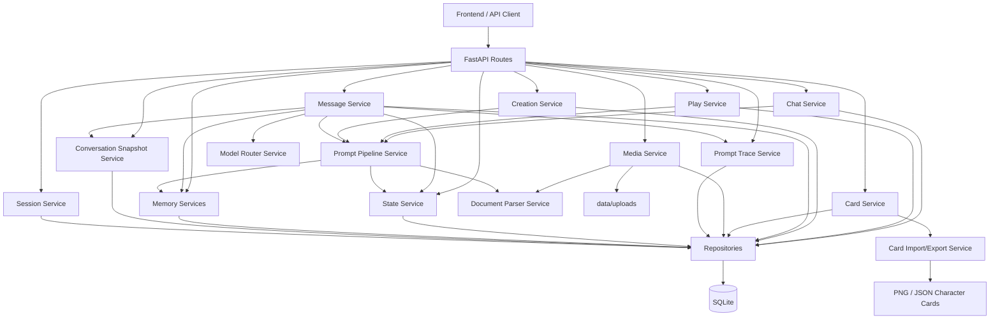

# ST-1 后端总结文档

## 1. 当前状态

当前后端已经完成从“设计型原型”到“可联调后端 MVP”的核心跃迁。

已具备的主能力包括：

- 多模式会话体系：聊天模式、游玩模式、创作模式
- 统一消息主链路：发消息、回滚、编辑、重生成、swipe、锁定
- Prompt 管线：全局预设、模式预设、角色卡、世界书、状态、记忆、附件、跨模式引用注入
- Prompt Trace / Prompt Inspector 基础支撑
- 状态系统：状态提取、写库、快照恢复、回溯联动
- 记忆系统：中期摘要、长期记忆、自动清理与注入
- 多模态基础：附件上传、文档解析、消息绑定
- 角色卡导入导出：支持 SillyTavern `png/json` 导入，支持 `json/png` 导出
- 创作项目基础：项目、角色卡、创作会话、创作首页聚合

当前后端已经可以支撑前端进入真实联调阶段。

---

## 2. 技术栈与目录

技术栈：

- Python 3.11+
- FastAPI
- SQLite
- Pydantic / pydantic-settings

核心目录：

- `backend/app/api/routes/`
  - API 路由层
- `backend/app/services/`
  - 业务服务层
- `backend/app/repositories/`
  - 数据访问层
- `backend/app/schemas/`
  - 请求/响应模型
- `backend/scripts/`
  - 联调脚本与后端验证脚本
- `sqlite_schema.sql`
  - SQLite 建表结构

---

## 3. 分层架构

后端采用典型的分层结构：

- Route 层
  - 负责 HTTP 路由暴露、参数绑定、响应模型声明
- Service 层
  - 负责模式逻辑、消息链路、Prompt 组装、状态/记忆处理、导入导出流程
- Repository 层
  - 负责 SQLite 查询与更新
- Schema 层
  - 负责请求体、响应体、内部结构化数据定义

这种结构的优点是：

- 模式逻辑与数据库访问解耦
- 后续前端联调时接口行为较稳定
- 便于继续扩展工具调用、创作项目、项目工作台等能力

---

## 4. 当前系统架构图

---

## 5. 核心主链路

### 5.1 消息发送主链路

主流程：

1. Route 接收消息请求
2. `MessageService` 创建用户消息
3. 绑定附件与结构化引用
4. `PromptPipelineService` 组装最终 prompt
5. `ModelRouterService` 选择并调用模型
6. 解析输出，生成 assistant 消息与 swipe
7. 写入 Prompt Trace
8. 提取状态更新
9. 触发记忆摘要与长期记忆逻辑
10. 更新会话统计信息

### 5.2 角色卡导入导出链路

导入：

1. 上传 `png/json`
2. `CharacterCardTranscoderService` 解析 ST 角色卡内容
3. 映射到当前角色卡模型
4. `CardService` 创建角色卡与版本

导出：

1. 读取当前角色卡与当前版本
2. 映射为 ST 兼容结构
3. 导出为 `json` 或携带 `chara` 元数据的 `png`

### 5.3 创作模式链路

主流程：

1. 创作首页读取项目、角色卡、最近编辑记录
2. 进入角色卡详情页或项目详情页
3. 基于角色卡创建创作会话
4. 复用统一消息主链路发送创作指令
5. 查看 Prompt Trace、Quick Reply、会话导出与复制

---

## 6. 已实现模块概览

### 6.1 基础平台层

- 健康检查
- 配置加载
- 数据库初始化
- 全局异常处理

### 6.2 会话与消息层

- 通用 session create/copy
- message list/get/send/update/regenerate
- swipe activate/delete
- rollback
- lock/unlock

### 6.3 Prompt 与调试层

- Prompt 组装器
- 模式预设注入
- 角色卡 / 世界书 / 状态 / 记忆 / 附件注入
- Prompt Trace 保存与查询
- Inspector 所需的结构化 trace 数据

### 6.4 状态与记忆层

- 状态提取与写库
- 状态快照与恢复
- 中期摘要
- 长期记忆
- 编辑/回滚后的记忆清理

### 6.5 多模态层

- 文件上传
- 文档附件绑定
- 文本型文档内容解析
- 媒体资源下载

### 6.6 模式层

- `play`
  - 已有卡片列表、详情、开场、会话创建、状态、快照、导出、trace
- `chat`
  - 已有会话管理、最近角色卡、跨模式引用、自动命名、模型切换、trace
- `creation`
  - 已有项目 API、首页聚合、角色卡编辑接口、创作会话、copy/export、trace

---

## 7. 当前主要 API 分组

### 7.1 通用接口

- `/v1/sessions`
- `/v1/messages`
- `/v1/prompt-traces`
- `/v1/states`
- `/v1/conversation-snapshots`
- `/v1/media`
- `/v1/cards`

### 7.2 模式接口

- `/v1/play/*`
- `/v1/chat/*`
- `/v1/creation/*`

### 7.3 记忆接口

- `/v1/sessions/{session_id}/memory-summaries/*`
- `/v1/sessions/{session_id}/long-term-memories/*`

---

## 8. 当前创作模式后端能力

已实现：

- 创作项目列表 / 创建 / 详情 / 更新
- 创作首页聚合接口
- 创作角色卡列表 / 详情 / 创建 / 更新
- 创作会话创建 / 概览 / 重命名 / 归档 / 切模型
- 创作会话复制 / 导出
- 创作模式 Quick Reply
- 创作模式 Prompt Trace 查询

说明：

- 当前“项目工作台”后端已经有基础项目接口，但还没有把世界书树、项目级资源树、项目级编辑器布局相关接口全部细化。

---

## 9. 已验证脚本

当前仓库中已具备多条后端联调脚本：

- `backend/scripts/test_f1_play_flow.py`
- `backend/scripts/test_f2_chat_flow.py`
- `backend/scripts/test_f3_creation_flow.py`
- `backend/scripts/test_e2_memory_flow.py`
- `backend/scripts/test_card_import_export.py`

这些脚本已经覆盖当前最核心的主链路能力。

---

## 10. 当前后端仍可继续增强的方向

虽然已经达到可联调阶段，但从“产品化后端”角度看，还可以继续做：

- 更完整的 `creation_projects` 资源树接口
- 项目级世界书与创作资产工作台接口
- 更系统的 pytest 测试组织，而不只是脚本式联调
- 更完整的日志与监控
- 更清晰的 OpenAPI 文档补充
- 更完善的权限、用户体系与云端部署方案
- 附件处理与多模态能力继续深化

---

## 11. 结论

当前 ST-1 后端已经完成了第一阶段最关键的基础闭环：

- 数据层可用
- 消息层可用
- Prompt 层可用
- 状态与记忆可用
- 三种模式后端入口可用
- 角色卡导入导出可用

这意味着项目已经具备：

- 进入前端联调阶段的条件
- 从“文档驱动设计”进入“真实产品实现”的条件
- 继续做 G 阶段前端与 H 阶段收敛的条件

如果后续以前端为主推进，这份后端已经足够作为稳定底座使用。
